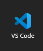
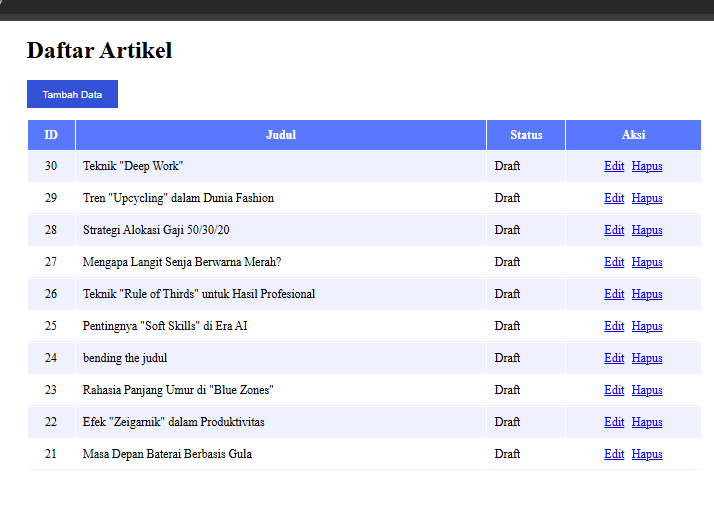
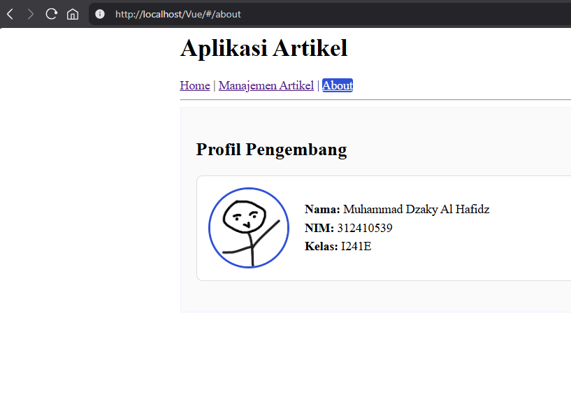

# Berkenalan dengan Vuejs

Kita akan pakai framework JavaScript untuk membangun interface website yang interaktif.

## Langkah-langkah

1. **Persiapan**
    - Editornya, misal Visual Studio Code.
    
    
    - Library VueJS ```<script src="https://unpkg.com/vue@3/dist/vue.global.js"></script>```

    - Library Axios ```<script src="https://unpkg.com/axios/dist/axios.min.js"></script>```

    - Direktori [Lab11Web_CI4](https://github.com/laLafid/Lab11Web_CI4)


2. **Buat Tampilan Awal**
    - index.html
    ```html
    <html lang="en">

    <head>
        <meta charset="UTF-8">
        <meta name="viewport" content="width=device-width, initial-scale=1.0">
        <title>Frontend Vuejs</title>
        <script src="https://unpkg.com/vue@3/dist/vue.global.js"></script>
        <script src="https://unpkg.com/axios/dist/axios.min.js"></script>
        <link rel="stylesheet" href="assets/css/style.css">
    </head>

    <body>
        <div id="app">
            <h1>Daftar Artikel</h1>
            <table>
                <thead>
                    <tr>
                        <th>ID</th>
                        <th>Judul</th>
                        <th>Status</th>
                        <th>Aksi</th>
                    </tr>
                </thead>
                <tbody>
                    <tr v-for="(row, index) in artikel">
                        <td class="center-text">{{ row.id}}</td>
                        <td>{{ row.judul}}</td>
                        <td>{{ statusText(row.status)}}</td>
                        <td class="center-text"><a href="#" @click="edit(row)">Edit</a><a href="#"
                                @click="hapus(index, row.id)">Hapus</a></td>
                    </tr>
                </tbody>
            </table>
        </div>
        <script src="assets/js/app.js"></script>
    </body>

    </html>
    ```
    
    - app.js
    ```js
    const { createApp: createApp } = Vue,
    apiUrl = "http://localhost/project-root/public";
    createApp({
    data: () => ({
        artikel: "",
        formData: { id: null, judul: "", isi: "", status: 0 },
        showForm: !1,
        formTitle: "Tambah Data",
        formTitles: [{ text: "Tambah Datas" }],
        statusOptions: [
        { text: "Draft", value: 0 },
        { text: "Publish", value: 1 },
        ],
    }),
    mounted() {
        this.loadData();
    },
    methods: {
        loadData() {
        axios
            .get(apiUrl + "/post")
            .then((t) => {
            this.artikel = t.data.artikel;
            })
            .catch((t) => {});
        },
        tambah() {
        ((this.showForm = !0),
            (this.formTitle = "Tambah Data"),
            (this.formData = { id: null, judul: "", isi: "", status: 0 }));
        },
        hapus(t, a) {
        confirm("Yakin menghapus data?") &&
            axios
            .delete(apiUrl + "/post/" + a)
            .then((a) => {
                this.artikel.splice(t, 1);
            })
            .catch((t) => {});
        },
        edit(t) {
        ((this.showForm = !0),
            (this.formTitle = "Ubah Data"),
            (this.formData = {
            id: t.id,
            judul: t.judul,
            isi: t.isi,
            status: t.status,
            }));
        },
        saveData() {
        (this.formData.id
            ? axios
                .put(apiUrl + "/post/" + this.formData.id, this.formData)
                .then((t) => {
                this.loadData();
                })
                .catch((t) => {})
            : axios
                .post(apiUrl + "/post", this.formData)
                .then((t) => {
                this.loadData();
                })
                .catch((t) => {}),
            (this.formData = { id: null, judul: "", isi: "", status: 0 }),
            (this.showForm = !1));
        },
        statusText: (t) => (t ? (1 == t ? "Publish" : "Draft") : ""),
    },
    }).mount("#app");
    ```

    - Penampilannya 
    

    - [style.css](assets/css/style.css)

    - sebelum diakhiri tambahin dulu code ini, untuk fungsi tambah data
    ```html
        <button id="btn-tambah" @click="tambah">Tambah Data</button>
            <div class="modal" v-if="showForm">
                <div class="modal-content"><span class="close" @click="showForm=false">&times;</span>
                    <form id="form-data" @submit.prevent="saveData">
                        <h3 id="form-title">{{ formTitle}}</h3>
                        <div><input type="text" name="judul" id="judul" v- model="formData.judul" placeholder="Judul"
                                required></div>
                        <div><textarea name="isi" id="isi" rows="10" v- model="formData.isi"></textarea></div>
                        <div><select name="status" id="status" v- model="formData.status">
                                <option v-for="option in statusOptions" :value="option.value">{{ option.text}}
                                </option>
                            </select></div><input type="hidden" id="id" v-model="formData.id"><button type="submit"
                            id="btnSimpan">Simpan</button><button @click="showForm=false">Batal</button>
                    </form>
                </div>
            </div>
            ```

3. **VueJS Komponen dan Routing (Single Page Application)**
    - Membuat File Komponen Halaman Utama [home.js](assets/js/component/home.js)

    - Memindahkan Kode Fitur Artikel ke Komponen [artikel.js](assets/js/component/artikel.js)

    - Mengonfigurasi Vue Router pada [app.js](assets/js/app.js)

    - Tambahkan halamana [about.js](assets/js/component/about.js)

    - Memodifikasi Master Layout pada [index.html](index.html)


## Hasil Akhir


